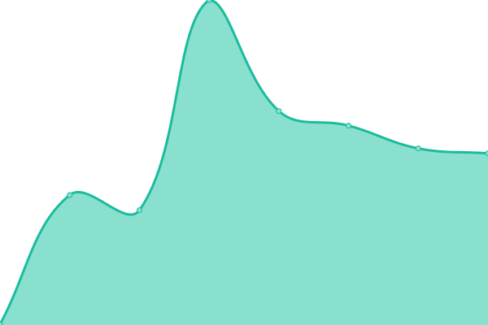

# [📈 Live Status](https://hufman.github.io/upptime): <!--live status--> **🟧 Partial outage**

This repository contains the open-source uptime monitor and status page for [Upptime](https://upptime.js.org), powered by [Upptime](https://github.com/upptime/upptime).

With [Upptime](https://upptime.js.org), you can get your own unlimited and free uptime monitor and status page, powered entirely by a GitHub repository. We use [Issues](https://github.com/upptime/upptime/issues) as incident reports, [Actions](https://github.com/hufman/upptime/actions) as uptime monitors, and [Pages](https://hufman.github.io/upptime) for the status page.

<!--start: status pages-->
<!-- This summary is generated by Upptime (https://github.com/upptime/upptime) -->
<!-- Do not edit this manually, your changes will be overwritten -->
<!-- prettier-ignore -->
| URL | Status | History | Response Time | Uptime |
| --- | ------ | ------- | ------------- | ------ |
|  [VGMdb API](https://vgmdb.info) | 🟥 Down | [vg-mdb-api.yml](https://github.com/hufman/upptime/commits/HEAD/history/vg-mdb-api.yml) | 

 4975ms
     
 | 

<a href="https://hufman.github.io/upptime/history/vg-mdb-api">45.88%</a>
    

|  [Home Assistant](https://hass.chez.chat/lovelace) | 🟩 Up | [home-assistant.yml](https://github.com/hufman/upptime/commits/HEAD/history/home-assistant.yml) | 

 486ms
     
 | 

<a href="https://hufman.github.io/upptime/history/home-assistant">100.00%</a>
    

|  [Gonic](https://listen.alucodev.net) | 🟥 Down | [gonic.yml](https://github.com/hufman/upptime/commits/HEAD/history/gonic.yml) | 

 0ms
     
 | 

<a href="https://hufman.github.io/upptime/history/gonic">0.00%</a>
    

|  [Owncast](https://owncast.hufman.me) | 🟩 Up | [owncast.yml](https://github.com/hufman/upptime/commits/HEAD/history/owncast.yml) | 

 1095ms
     
 | 

<a href="https://hufman.github.io/upptime/history/owncast">100.00%</a>
    

|  [Akkoma](https://akkoma.chez.chat) | 🟩 Up | [akkoma.yml](https://github.com/hufman/upptime/commits/HEAD/history/akkoma.yml) | 

 1101ms
     
 | 

<a href="https://hufman.github.io/upptime/history/akkoma">97.22%</a>
    

<!--end: status pages-->

[**Visit our status website →**](https://hufman.github.io/upptime)

## 📄 License

- Powered by: [Upptime](https://github.com/upptime/upptime)
- Code: [MIT](./LICENSE) © [Upptime](https://upptime.js.org)
- Data in the `./history` directory: [Open Database License](https://opendatacommons.org/licenses/odbl/1-0/)
